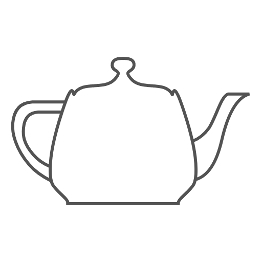

  
  <h1 align="center">CG</h1>
  <h4 align="center">A VS Code extension for animation, VFX and gaming softwares</h4>
   

## Feature Details:

* [Autodesk: Maya](http://www.autodesk.in/products/maya/overview)
  + Code Execution of python and mel
  + Mel Syntax highlighting

* [The Foundry: Mari](https://www.thefoundry.co.uk/products/mari/)
  + Code Execution of python

## Quick Start:

* Install the extension

## Issues and Feature Requests:

* Contributions are always welcome.
* Any and all feedback is appreciated and welcome.
  + Please feel free to [add suggestions here](https://github.com/cg-cnu/code-cg/issues)

## Change Log
[Releases](https://github.com/cg-cnu/code-cg/releases)

## Source
[GitHub](https://github.com/cg-cnu/code-cg)

## License
[MIT](https://github.com/cg-cnu/code-cg/issues/master/LICENSE)